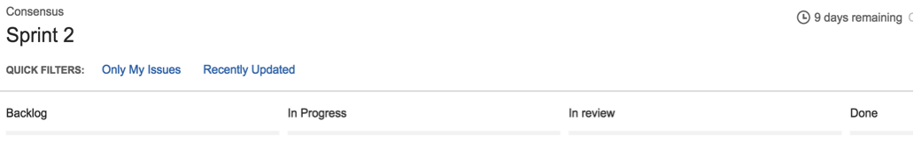

使用Jira来了解当前的工作流项
===========================================

本文档旨在创建进一步了解基于社区路线图的Hyperledger Fabric v1架构方面的工作进展。
路线图在 `Jira <https://jira.hyperledger.org/>`__ 被更踪。

采用Sprints来管理，并且展示在反馈列表中的问题实现的优先级。我们使用面板来实现这些功能。通过点击
 **Boards** -> **Manage Boards** 来查看这些面板：

   Jira 面板

现在在左侧点击 **全部面板** ：

   Jira 面板

在这里，你可以看到b所有被创建的公共的（或者受限制的）面板。
如果你想看当前sprint下的条目，请点击 **可见性** 为 **全部用户** ，而且 **面板类型** 
是 **Scrum** 的。举个例子， **面板名称** Consensus：

.. figure:: images/Jira2.png
   :alt: Jira boards

   Jira 面板

当你点击了 **面板名称** 下的Consensus之后，你会被重定向到下面的列中：

   Jira 面板

这些列的含义如下:

-  Backlog – 为当前sprint计划的条目 (sprints的定义是2周一个迭代), 但是不在当前的sprint中。
-  In progress – 由某些人正在进行的条目。
-  In Review – 在Gerrit中正在等待审查和合并的条目。
-  Done – 在这个sprint中已经合并完成的条目。

如果你希望查看某一个特性的backlog的所有条目，点击导航栏左侧堆积的行即可：

.. figure:: images/Jira4.png
   :alt: Jira boards

   Jira 面板

这张图展示了当前的sprint的条目，所有的底部的待办的条目。所有的条目都按优先级排列。

如果有一个你感兴趣的条目正在进行，你有一些问题或者想了解一些信息，
或者你觉得有些条目有必要提高优先级，请在Jira上直接评论。
感谢所有有帮助的反馈和帮助。

.. Licensed under Creative Commons Attribution 4.0 International License
   https://creativecommons.org/licenses/by/4.0/

