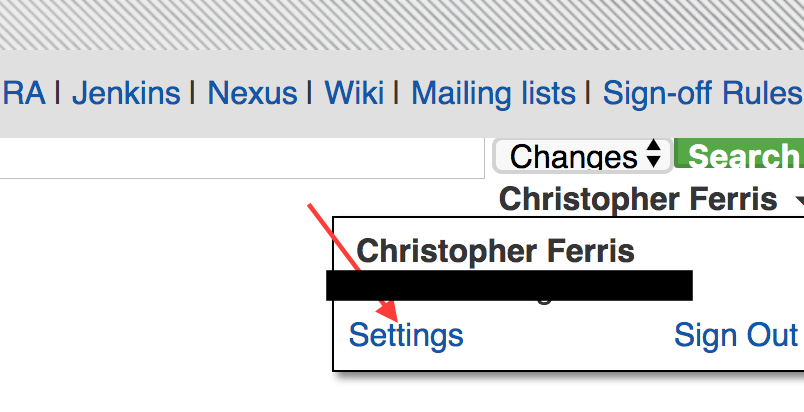
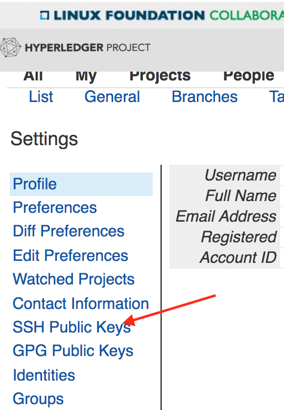
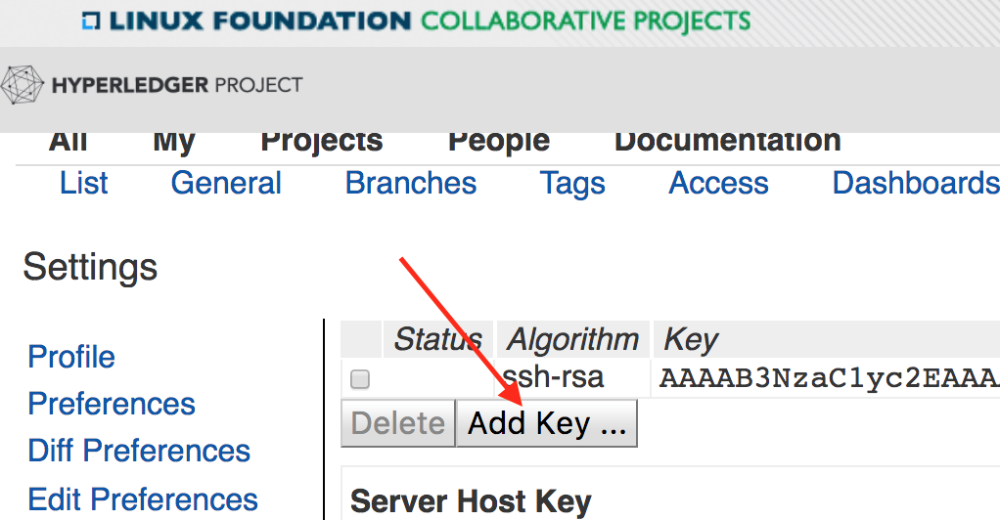
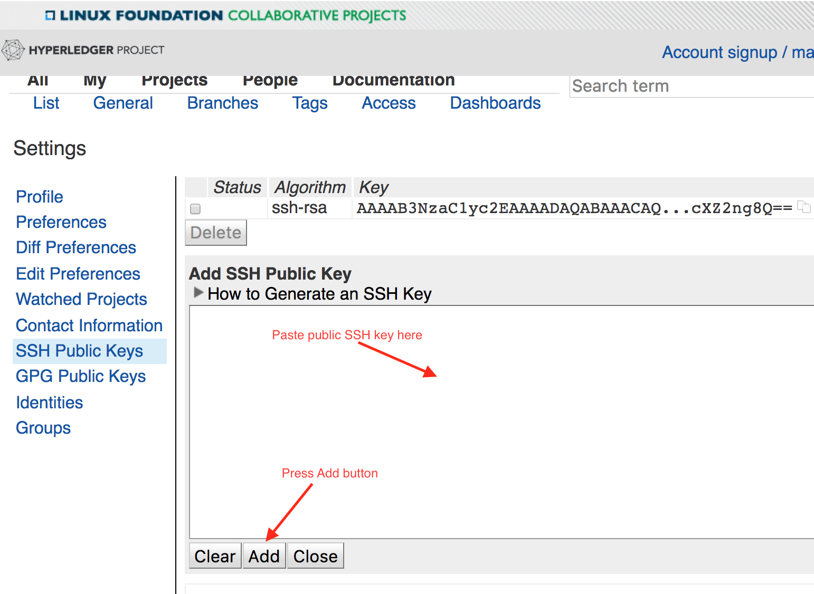
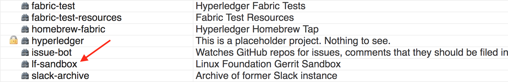
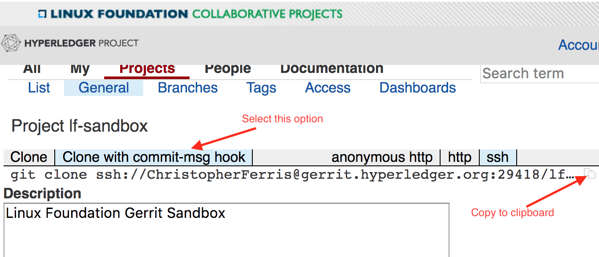

提交你的第一个变更申请(CR)
-----------------------------------------

我们使用
`Gerrit <https://gerrit.hyperledger.org/r/#/admin/projects/fabric>`__
进行代码贡献和审查工作。如果你不熟悉Gerrit，请先参考 :doc:`文档 <Gerrit/gerrit>` 。

.. note:: Gerrit的用户体验不是很好。但是，谷歌团队已经在提升这方面了，他们添加了"New UI"来提升用户体验。 
          请参考上述链接Fabric Gerrit页面下方的按钮。

          .. image:: images/NewGerritUI.png

设置你的SSH key
~~~~~~~~~~~~~~~~~~~~~~~

在你提交变更之前，你需要注册你的SSH key。使用你的
:doc:`LFID <Gerrit/lf-account>` 登录
`Gerrit <https://gerrit.hyperledger.org>`__ ，
点击浏览器右上角你的名字，然后点击 'Settings'。

在左边框上，你可以看到一个'SSH Public Keys'的链接。

请点击``Add Key...``的按钮。

复制-粘贴你的 `public SSH key <https://help.github.com/articles/generating-an-ssh-key/>`__ 
到窗口中并点击 'Add'。

沙箱
~~~~~~~

我们已经创建了一个
`lf-sandbox 项目 <https://gerrit.hyperledger.org/r/#/admin/projects/lf-sandbox,branches>`__ ，
来让你熟悉Gerrit。我们会在我们的教程中使用这个项目提交您的第一个CR。

克隆你的项目
~~~~~~~~~~~~~~~~~~

第一步是克隆你的项目到你的笔记本或者开发服务器上。将浏览器导航到
`Projects <https://gerrit.hyperledger.org/r/#/admin/projects/>`__
页面，然后滚动到 ``lf-sandbox`` 项目。

这个项目页面会为你提供git clone的完整命令。选择 ``clone with commit-msg hook`` 选项，然后复制到剪切板。

Now, in a terminal window on your laptop, paste and run the command. e.g.

现在，在你的笔记本命令行终端中，粘贴并且运行这个命令。例如：

.. code::

   git clone ssh://foobar@gerrit.hyperledger.org:29418/lf-sandbox && scp -p -P 29418 foobar@gerrit.hyperledger.org:hooks/commit-msg lf-sandbox/.git/hooks/

检出开发分支
~~~~~~~~~~~~~~~~~~~~~~~~~~~~~

现在，你已经克隆了仓库，移动到 ``lf-sandbox``
目录。现在，让我们开始改变一下。让我们在这个仓库下创建一个新分支来开始工作：

.. code::

   git checkout -b <newbranchname>

现在修改一个文件。选择一个文件，任何文件都可以，并且修改它。
也可以新增一个文件或者删除一个现有的文件。不要担心，这只是一个沙箱。

提交你的变更
~~~~~~~~~~~~~~~~~~~~~~

一旦你做了修改，请检查一下当前的状态。

.. code::

   git status
   On branch foo
   Untracked files:
    (use "git add <file>..." to include in what will be committed)

	 README.md

   nothing added to commit but untracked files present (use "git add" to track)

现在让我们将变更的文件添加到git追踪的文件中去。

.. code::

   git add .

现在提交变更。

.. code::

   git commit -s

这将开启使用你喜欢的命令行编辑器来作为一个新的编辑环境让你填写提交信息。添加提交信息。

.. note:: 请注意我们将添加一行包括问题JIRA号的标题来表明对Hyperledger Fabric做了哪些变更。 请查看变更的
          :doc:`指南 <Gerrit/changes>` 。

.. code::

   FAB-1234

   I made a change

   Signed-off-by: John Doe <john.doe@example.com>

   # Please enter the commit message for your changes. Lines starting
   # with '#' will be ignored, and an empty message aborts the commit.
   # On branch foo
   # Changes to be committed:
   #       new file:   README.md
   #

提交你的变更申请
~~~~~~~~~~~~~~~~~~~~~~~~~~~~~~

一旦你提交了这次修改，你可以发送一个变更申请到Gerrit上去。这里，我们有几个选择。

第一个选项是使用完整的git语法。

.. code::

   git push origin HEAD:refs/for/master

这将产生如下结果：

.. code::

   Counting objects: 3, done.
   Delta compression using up to 4 threads.
   Compressing objects: 100% (2/2), done.
   Writing objects: 100% (3/3), 340 bytes | 0 bytes/s, done.
   Total 3 (delta 1), reused 0 (delta 0)
   remote: Resolving deltas: 100% (1/1)
   remote: Processing changes: new: 1, refs: 1, done
   remote: Missing issue-id in commit message
   remote: Commit 539d9a1fe036f332db87d37b49cea705bdf6e432 not associated to any issue
   remote:
   remote: Hint: insert one or more issue-id anywhere in the commit message.
   remote:       Issue-ids are strings matching ([A-Z][A-Z0-9]{1,9}-\d+)
   remote:       and are pointing to existing tickets on its-jira Issue-Tracker
   remote:
   remote: New Changes:
   remote:   https://gerrit.hyperledger.org/r/16157 I made a change
   remote:
   To ssh://gerrit.hyperledger.org:29418/lf-sandbox
    * [new branch]      HEAD -> refs/for/master

第二种选择，
`git review <https://www.mediawiki.org/wiki/Gerrit/git-review>`__ 
大大简化了流程。上述的链接将提供如何安装和设置 ``git-review`` 的方法。

一旦安装和配置好之后，你可以通过 ``git review`` 来提交你的变更。

::

    $ git review

检查你的变更请求已经被CI校验通过了
~~~~~~~~~~~~~~~~~~~~~~~~~~~~~~~~~~~~~~~~~~~~~~~~~~~~~~~~~~~~~

为了确保代码的稳定性和限制可能的回归，我们使用Jenkins上的持续集成（CI）程序通过触发器的形式
在不同的平台上运行被提交的每个变更的测试。确保你的CR能够通过测试也是你的责任。
没有CR会在没有通过测试的情况下被merge，你也不要期望代码在没有通过测试的时候有人来review你的CRs。

如果要检查你的CR的CI进度，你可以在Gerrit上进行查看，下面的URL是你之前提交的CR的结果。
在页面的底部会有你提交的历史记录，会显示一系列带有 "Hyperledger Jobbuilder"的动作来对应CI执行的进度。

当完成的时候， "Hyperledger Jobbuilder" 会添加一个 *+1 vote* 如果失败了会添加一个 *-1 vote* 。

如果失败了，请查看CR关联的日志。如果你发现CR有问题，请继续下面的部分。

如果你发现你的CR没有什么问题，或许CI程序仅仅因为一些无关的原因失败了。
在这种情况下，你可以通过回复你的CR "reverify"来重新运行CI程序。检查
`<https://github.com/hyperledger/ci-management/blob/master/docs/source/fabric_ci_process.rst>`__
来关注相关信息和选项。

修改你的变更请求
~~~~~~~~~~~~~~~~~~~~~~~~~~~~~

如果你更新了你的补丁，在评论里面注明，或者修复了影响CI的问题，你可以在提交一个修订国的变更

.. code::

   git commit --amend

然后重复 ``git review`` 命令，和之前一样。然后检查一下CI的结果。

如果你还有问题，可以在邮件列表或者Rockt Chat上提问，不要犹豫！
